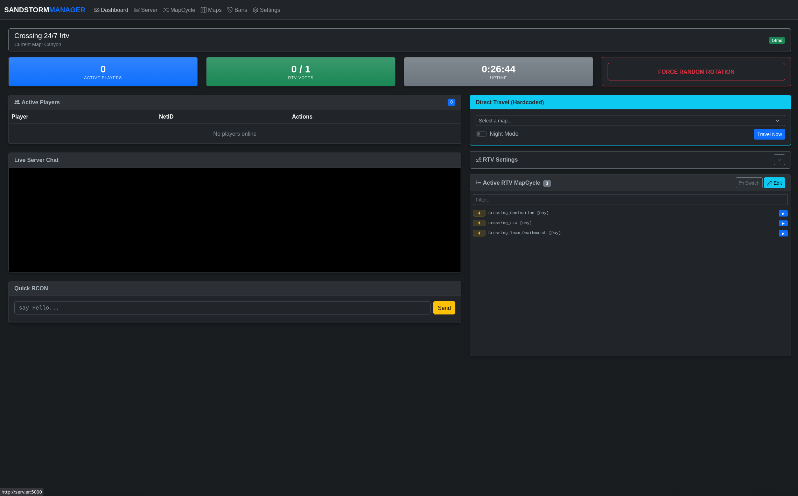
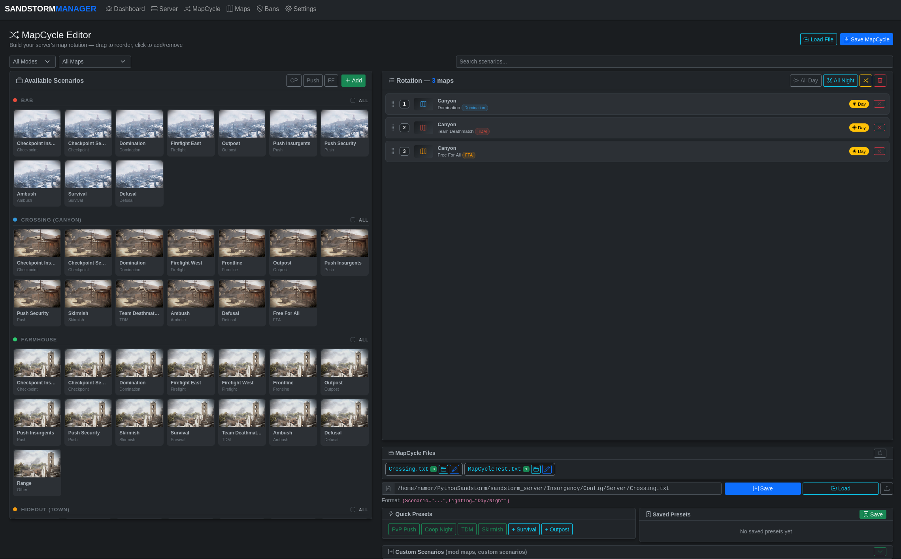
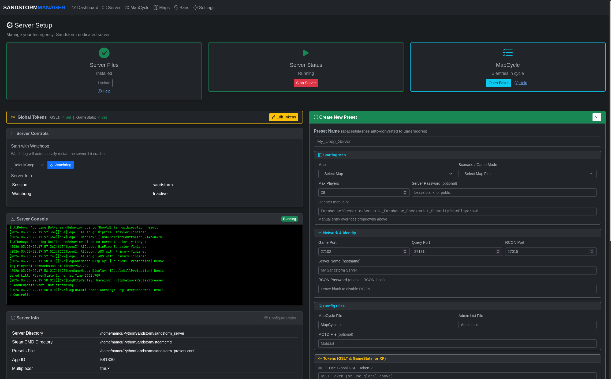

# Insurgency: Sandstorm Web Manager

A lightweight web interface for installing, configuring, and managing Insurgency: Sandstorm dedicated servers on Linux.

## Screenshots

**Live Dashboard (RCON, Players, Chat)**  


**Visual MapCycle Editor**  


**Server Configuration & Installation**  


## Features
* 1-click SteamCMD & server installation.
* Live dashboard for RCON, chat, and player management.
* Drag-and-drop MapCycle editor with visual thumbnails.
* Preset manager to save game modes, mutators, and server flags.
* Background process manager (via `tmux`) with auto-restart watchdog.
* Built-in Rock The Vote (RTV) system.
* Automated fix for the ModioBackground CPU bug.
* Global token management for XP/Stats.

## Requirements
Your Linux host needs a few basic packages:
```bash
sudo apt update
sudo apt install python3 python3-pip tmux wget tar
```

## Installation & Usage

1. Download the Python script and the `mappictures/` folder. Ensure they stay in the same directory so the MapCycle editor can load the thumbnails.
2. Install the required Python packages:
   ```bash
   pip3 install flask requests
   ```
3. Run the manager:
   ```bash
   python3 sandstorm_manager.py
   ```
4. Open your web browser and navigate to:
   ```text
   http://<your-server-ip>:5000
   ```
   *(Use `http://localhost:5000` if hosting on your own PC)*
5. Navigate to the **Server** tab and click **Install Server**. The script will automatically download SteamCMD and the game files (~30GB). 

Once the installation finishes, you can create a preset and start the server directly from the web interface.

## Ports to Forward
If you are hosting behind a router or firewall, open these ports:
* **27102 (UDP)** - Default Game Port
* **27131 (UDP)** - Default Query Port

## Enabling Player XP
To allow players to earn XP, enter your GSLT and GameStats tokens in the "Global Tokens" section of the Server tab. The manager will auto-fill them into your server presets.
* **GSLT Token:** Generate at [Steam Server Management](https://steamcommunity.com/dev/managegameservers) (Use App ID: `581320`)
* **GameStats Token:** Generate at [Sandstorm GameStats](https://gamestats.sandstorm.game/)
